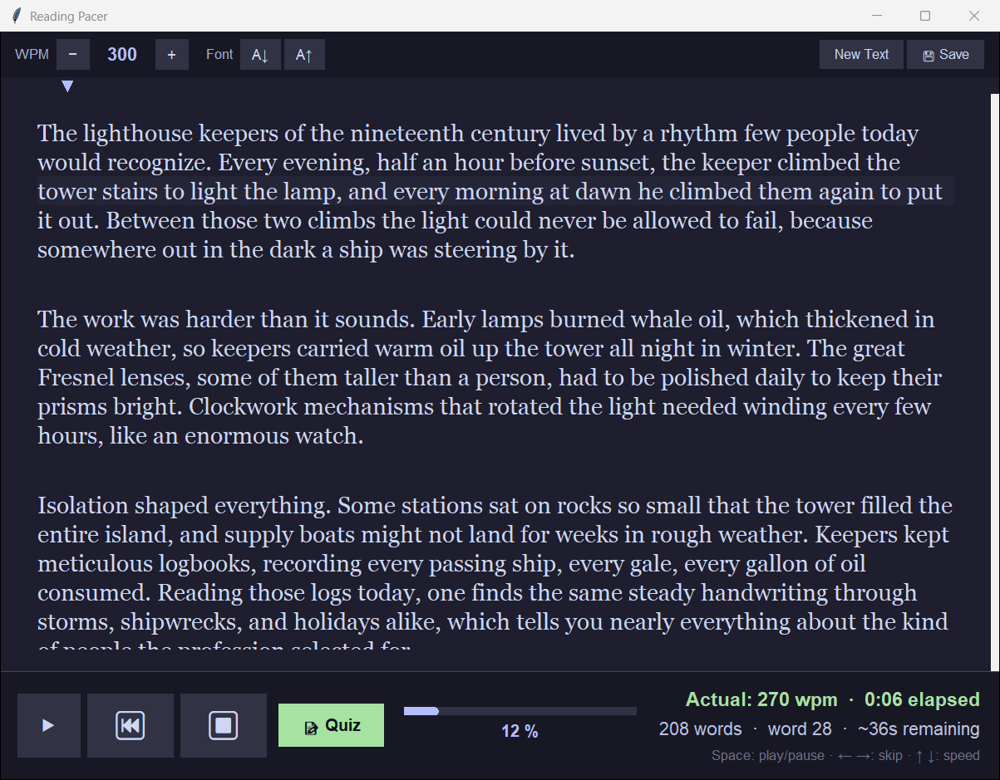
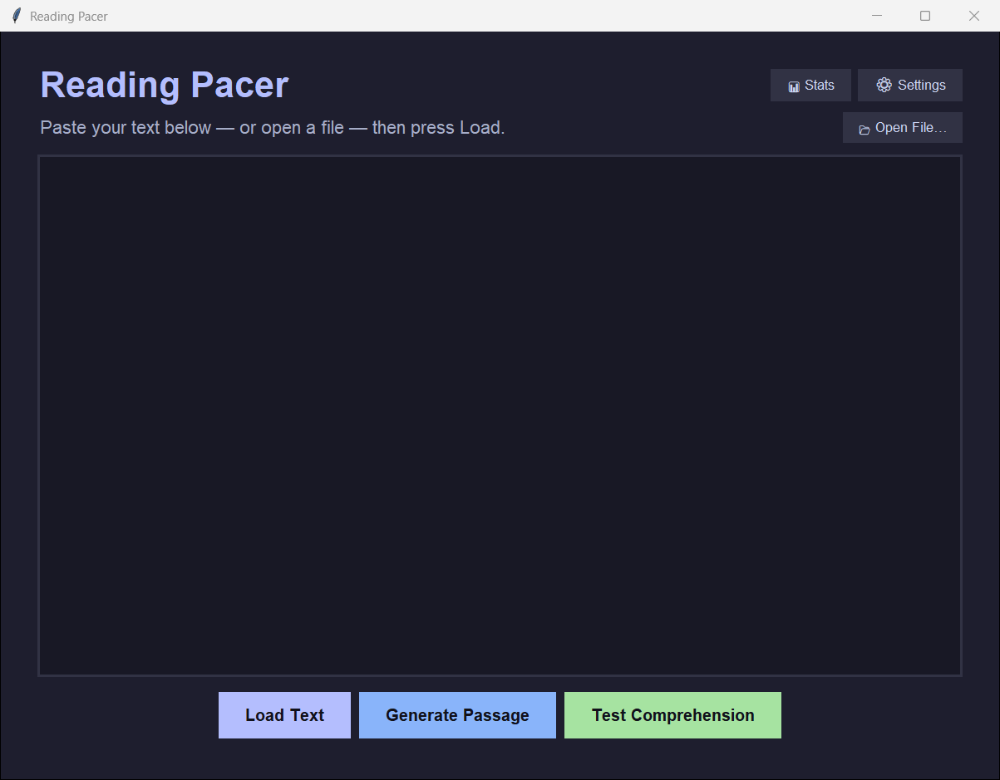

# Reading Pacer

**Train yourself to read faster *without* losing comprehension.**

A distraction-free desktop reading pacer with AI-generated comprehension quizzes.
Paste any text, set your words-per-minute, and a smooth arrow glides along the
words to keep your eyes moving. When you're done, take a quiz generated from
*exactly what you just read* — so you know whether that speed actually stuck.




<details>
<summary>More screenshots</summary>

The landing screen — paste text, open a file, or generate a passage:



</details>

## Why a pacer?

Most people read far below the speed they're capable of, because their eyes
wander and re-read. A pacer gives your eyes a target to chase. But raw speed is
meaningless if nothing sinks in — that's why Reading Pacer pairs the pacer with
**progressive-difficulty comprehension quizzes** (question 1 is easy surface
recall; the last one targets a detail buried deep in the passage). Track both
numbers over time and find *your* optimal speed.

## Features

- **Smooth pacing arrow** that slides word-to-word at your chosen WPM, with
  line highlighting, auto-scroll, click-to-jump, and a scrubbable progress bar
- **Actual-speed tracking** — see the WPM you really read at, not just the dial
- **AI comprehension quizzes** on any text, with a review of what you missed
- **AI passage generation** — pick a topic, style, difficulty, and length
- **Reading stats** 📊 — words read, time, and a speed + comprehension trend chart
- **Save & resume** — close the app mid-chapter, pick up where you left off
- **Open files** (`.txt`, `.md`) or paste anything
- **Catppuccin themes** — Mocha (dark) and Latte (light)
- **Runs on Windows, macOS and Linux**, with an installer, one-click updates,
  and no Python needed for the downloads

## Install

No Python needed for either download. Both are on the
[latest release](https://github.com/Bloodtailor/reading-pacer/releases/latest) page.

### Windows 10 / 11

1. Download **`ReadingPacer-Setup-<version>.exe`** and run it.
2. Windows SmartScreen may say *"Windows protected your PC"* because the app
   isn't code-signed (that costs money every year for a free app). Click
   **More info → Run anyway**.
3. Click through the installer. No admin rights needed. It adds Reading Pacer
   to your Start Menu (and optionally your desktop).

**Updates:** the app checks for new versions when it starts and can update
itself in one click. Turn this off in ⚙ Settings → Updates.

**Uninstall:** Settings → Apps → Installed apps → Reading Pacer → Uninstall.
It asks whether to also delete your settings and reading history.

Prefer no installer? Download **`ReadingPacer-<version>-portable.zip`**, unzip
it anywhere, and run `ReadingPacer.exe`. It works fine, but updates are manual.

### macOS 11 or later (Apple Silicon and Intel)

1. Download **`ReadingPacer-<version>-macOS.dmg`**, open it, and drag
   **Reading Pacer** into **Applications**.
2. The first time you open it, macOS will block it because the app isn't
   notarized by Apple (that needs a paid developer account):
   - **macOS 15 Sequoia and later:** open the app once and dismiss the warning.
     Then go to **System Settings → Privacy & Security**, scroll down, and click
     **Open Anyway** next to Reading Pacer.
   - **macOS 14 and earlier:** right-click (or Control-click) the app in
     Applications, choose **Open**, then click **Open**.
3. After that it opens normally. When a new version is out, the app tells you
   and takes you to the download page.

### From source (any OS)

Requires Python 3.10+ with tkinter (included in the standard python.org installers).

```bash
git clone https://github.com/Bloodtailor/reading-pacer.git
cd reading-pacer
pip install .
reading-pacer
```

Or run straight from the checkout without installing:

```bash
python -m reading_pacer
```

> **Optional — local models:** to run quizzes fully offline with a GGUF model,
> `pip install ".[local]"` (installs `llama-cpp-python`).

## Setting up the AI (optional)

The pacer itself works with no setup at all. Quizzes and passage generation
need a language model — **either** an API key **or** a local model:

### Option A: DeepSeek API (recommended — cheap and good)

1. Create a key at [platform.deepseek.com](https://platform.deepseek.com)
2. Open **⚙ Settings** in the app, paste the key, click **⚡ Test Connection**
3. Done — DeepSeek is the default provider

A typical quiz costs a fraction of a cent.

### Option B: any OpenAI-compatible API

Pick a preset in Settings or enter a custom endpoint:

| Provider | Notes |
|---|---|
| **DeepSeek** | Default. `deepseek-chat` |
| **OpenAI** | e.g. `gpt-4o-mini` |
| **OpenRouter** | Hundreds of models, one key |
| **Ollama** | Local server — no API key needed |
| **LM Studio** | Local server — no API key needed |

### Option C: local GGUF model

Install the `[local]` extra, then point Settings at a `.gguf` file. If both an
API and a local model are configured, the app automatically falls back to the
other when one fails.

## Configuration

Everything is editable in **⚙ Settings**, which persists to a `.env` file in
your user data directory (`%APPDATA%\ReadingPacer` on Windows,
`~/Library/Application Support/ReadingPacer` on macOS,
`~/.local/share/reading-pacer` on Linux). A `.env` in the working directory or
repo root takes precedence — handy for development. See
[.env.example](.env.example) for all keys. Set `READING_PACER_HOME` to keep
everything, including settings, in that one folder and ignore every other
location (portable mode).

## Keyboard shortcuts

| Key | Action |
|---|---|
| `Space` | Play / pause |
| `←` / `→` | Skip back / forward 5 words |
| `↑` / `↓` | Speed up / slow down (±25 WPM) |
| `+` / `-` | Font size |
| `Ctrl+S` | Save progress |
| `Ctrl+R` | Restart from the top |
| `1–4` or `A–D` | Answer quiz questions |

## Privacy

Your text stays on your machine. It is only sent to the API provider you
configured, and only when you press **Quiz** or **Generate Passage**. Use a
local model (Ollama, LM Studio, or a GGUF file) for fully offline operation.
Reading progress and stats are stored locally in your user data directory.

The only other network request is the update check: one call to GitHub's
public API at startup, which sends nothing about you or your reading. Turn it
off in ⚙ Settings → Updates.

## Something not working?

If the app hits an error, it shows a window with **Report on GitHub**, which
opens a pre-filled issue. Error details are also written to a log file in
your user data directory (`logs/reading-pacer.log`). Please
[open an issue](https://github.com/Bloodtailor/reading-pacer/issues) with it.

## Contributing

Issues and PRs are welcome!

```bash
pip install -e ".[dev]"
pytest        # run tests
ruff check .  # lint
reading-pacer --self-test   # launch the app and click through every screen
```

### How releases are tested

Every push runs the unit tests on Windows, macOS and Linux. It then builds the
real Windows installer and Mac app and tests them on fresh GitHub-hosted
machines. On Windows it installs, upgrades over the top, runs the self-test,
uninstalls, and checks that nothing is left behind. On Mac it installs from the
`.dmg` and runs the self-test on both Apple Silicon and Intel. Screenshots from
each machine are saved with the run. To publish a release, add a
`## x.y.z` section to [CHANGELOG.md](CHANGELOG.md), bump `__version__` in
`reading_pacer/__init__.py`, then push a tag:

```bash
git tag v1.1.0 && git push origin v1.1.0
```

To build locally, run `packaging\build-windows.ps1` (needs
[Inno Setup](https://jrsoftware.org/isinfo.php)) or `packaging/build-macos.sh`.

## License

[MIT](LICENSE)
